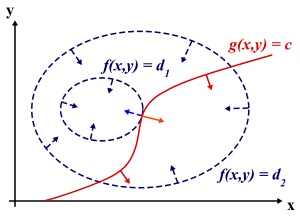

## Lagrange Multipliers

Consider the situation 2 dimension space

if $(x^*, y^*)$ is the local extremum, then the derivative of $f(x,y)$ and $g(x,y)$(just imagine that the derivatives are some direction) is _**collineation**_, so

$$\nabla f(x^*,y^*) + \lambda \nabla g(x^*,y^*) = 0$$

links: 
1. [zhihu1](https://www.zhihu.com/question/23311674)
2. [zhihu2](https://www.zhihu.com/question/38586401)
2. [csdn](http://blog.csdn.net/xianlingmao/article/details/7919597)